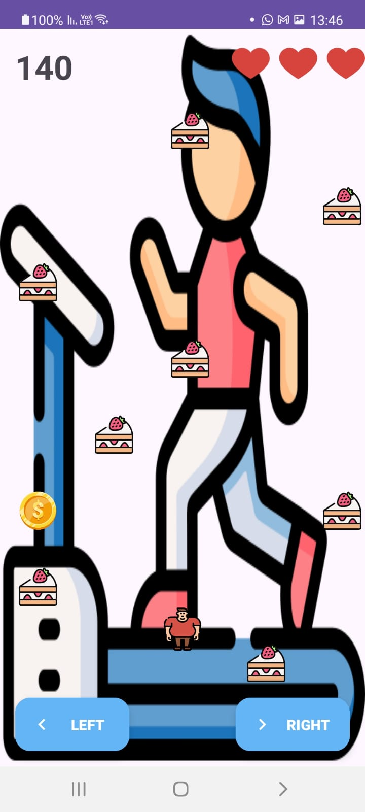

## Sweet Sprint App - Android Mobile Application 

Welcome to **My Android App**! This is an Android application built with Android Studio as Home Work of afeka's class.

## Table of Contents
- [Overview](#overview)
- [Features](#features)
- [Getting Started](#getting-started)
    - [Prerequisites](#prerequisites)
    - [Installation](#installation)
- [Usage](#usage)
- [Screenshots](#screenshots)

## Overview
**Sweet Sprint** is a game-based Android application where players collect items while navigating through different levels. It also features a high-score system that integrates with Google Maps to show where each score was achieved.

## Features
- Fun and interactive gameplay.
- Google Maps integration to display high scores by location.
- Dynamic settings for game speed and sensors.
- A leaderboard to track high scores.

## Getting Started

### Prerequisites
- Android Studio (latest version recommended).
- An Android device or emulator with API level 21 (Lollipop) or higher.
- Google Maps API key (for map functionalities).

### Installation
1. Clone the repository:
   ```bash
   git clone https://github.com/danielgerbi7/HW-Android.git
   ```
2. Open the project in Android Studio.
3. Add your Google Maps API key:
    - Open the `local.properties` file (or create it if it doesn't exist).
    - Add the following line with your API key:
      ```
      MAPS_API_KEY=your_api_key_here
      ```
4. Sync the project with Gradle.
5. Run the application on an emulator or physical device.

## Usage

### Main Menu
- **Start Game**: Begin a new game session.
- **Settings**: Adjust game speed and toggle sensors.
- **Records**: View high scores and their locations on the map.
- **Exit**: Close the application.

### In-Game Controls
- Use the **Left** and **Right** buttons to navigate.
- Avoid obstacles and collect items to increase your score.

### High Scores
- View your top 10 scores on the leaderboard.
- Tap on a score to zoom in on its location on the map.

## Screenshots

### Main Menu


### Game Screen


### Settings Screen


### High Scores and Map Integration


## Author
- [Daniel Jerbi](https://github.com/danielgerbi7)
